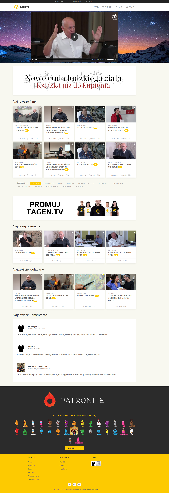

# Tagen UI

Kod odpowiedzialny za wyświetlanie strony telewizji internetowej [tagen.tv](https://tagen.tv). Obecnie jedynie strona główna jest w całości generowania przez JavaScript. Trwa tranzycja pozostałych części serwisu.




## Stos technologiczny:

* [VueJS](https://vuejs.org/)
* [Vuex](https://vuex.vuejs.org/)
* [GraphQL](https://graphql.org/)
* [Apollo Client](https://www.apollographql.com/docs/react/)


## Środowisko developerskie

```
yarn install
vue ui -p 9000
```


## Pomoc

Pull requesty lub zgłoszenia błędów zawsze mile widziane :-)